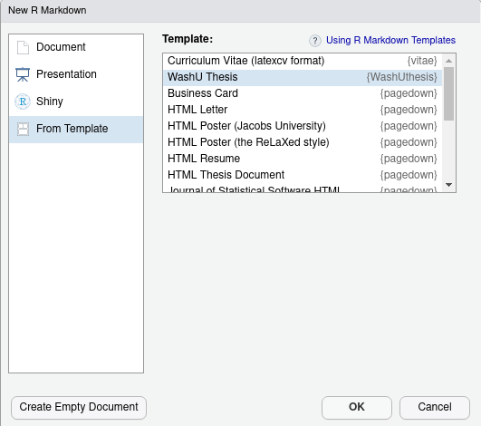
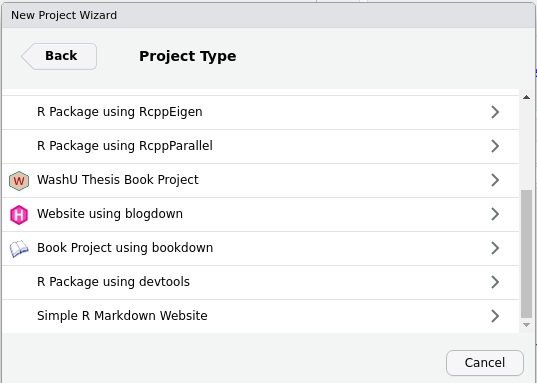

# WashUthesis 

[](https://github.com/duckmayr/WashUthesis/actions)

**WashUthesis** is an R package that provides an R Markdown format and template, as well as a [`bookdown`](https://github.com/rstudio/bookdown) project template, for a document that conforms to the requirements for theses/dissertations at Washington University in St. Louis.

## Installation

You can install the development version from GitHub via

``` r
devtools::install_github("duckmayr/WashUthesis")
```

## Usage

After installing this package, you can create your thesis either as a standalone R Markdown document or as a bookdown project. Then you just need to fill out the YAML frontmatter fields that are pre-filled with dummy values.

### Standalone Document

You can use the included R Markdown template in RStudio by going to File \> New File \> R Markdown \> From Template, then selecting the WashU Thesis template:



### Bookdown Project

You can use the included `bookdown` project template in RStudio by going to File \> New Project \> New Directory, then selecting the WashU Thesis Book Project template:



### YAML Frontmatter Fields

All the information the template needs are pre-filled with default or dummy values in the YAML header:

```yaml
---
site: bookdown::bookdown_site
title: "Your Title"
author: "Your Full Name as Recorded in WebSTAC"
authorshort: "Your Last Name"
department: "Your Department"
degree: "Doctor of Philosophy in Political Science"
degreeshort: "Doctor of Philosophy"
thesis: false
month: "The month you'll graduate; should be one of December, May, or August"
year: "The year you'll graduate"
committee:
    - "FirstName LastName, Chair"
    - "FirstName LastName"
    - "FirstName LastName"
chair:
    - "FirstName LastName, Chair"
copyright: true
dedication: false
dedication-text: ""
endnotes: false
tocdots: true
acknowledgments: "An acknowledgments page must be included in your final dissertation or thesis. If you wish to include a special dedication you can either use it to close the acknowledgments page or place it on the page that immediately follows. The acknowledgments page should be listed in the table of contents. Place it after the final list used in the document, and before any dedication, abstract, or epigraph that is included. It is appropriate to acknowledge sources of academic and financial support; some fellowships and grants require acknowledgment."
abstract: "An abstract is required for all dissertation submissions in ProQuest. An abstract is optional for master's thesis submissions."
bibliography: ""
appendix: false
---
```

For the most part, these fields are self-explanatory, though here are a few things to note:

- The `thesis` field, if set to `true`, will replace all references to a "dissertation" in the output to a reference to a "thesis"
- If `endnotes` are set to `true`, you will be responsible yourself for adding the command `\theendnotes` at the end of each chapter; the dissertation style guide specifies that endnotes must be placed at the end of each chapter, but unfortunately LaTeX doesn't know when a chapter ends, leading to this issue.
- If your dissertation/thesis has one or more appendices, you must set `appendix` to `true` to ensure proper placement of the bibliography
- The template is hardcoded at the moment to use [`biblatex`](https://ctan.org/pkg/biblatex?lang=en)

## Contributing

There are still some optional features of theses/dissertations allowed in the dissertation guidelines that have not yet been implemented; for example, in addition to lists of tables and figures, you can add lists of abbreviations and illustrations. I would welcome the implementation of any such features by others, or bug fixes if you encounter any technical difficulties in the use of this package, or any formatting inconsistencies with the guide that may have been overlooked. Before contributing, please consult the contributing guidelines in CONTRIBUTING.md

## License

GPL3
